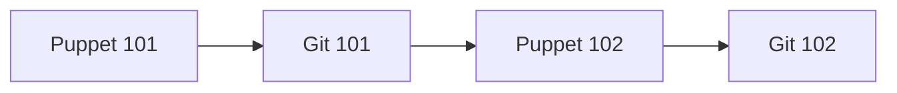

# Labs

Instructor-led lab sessions for platform engineering topics. These are hands-on companion guides designed to be worked through with an instructor, not self-paced. Each lab covers a focused set of skills with real servers and shared repositories.

## Available Labs

| Lab | Description | Duration |
|-----|-------------|----------|
| [Puppet 101](puppet-101.md) | Install packages, manage files, use templates, and explore facts with `puppet apply` | Half day |
| [Git 101](git-101.md) | Clone, edit, stage, commit, push, pull, and resolve merge conflicts | 2 hours |
| [Puppet 102](puppet-102.md) | Team modules, roles and profiles, Hiera data layers, and cluster-level configuration | Half day |
| [Git 102](git-102.md) | Branching, merging, reverting, stashing, and pull requests | 3 hours |

## Recommended Learning Path

Follow the arrows. Each lab builds on concepts from the ones before it.

Puppet 101 comes first so participants understand what they're version-controlling when they get to Git. Puppet 102 builds on both foundations before Git 102 introduces branching and pull requests.

## Requesting a Lab

**For your team:** If you'd like to schedule a lab session for your team, reach out to the platform engineering team. We can run any of the labs above for groups of up to 40 participants. We'll handle the server setup and provide all the materials.

**For individuals:** New hires or anyone looking to brush up on skills can request one-on-one training. We'll tailor the session to your experience level and focus on the areas most relevant to your work.

Contact the platform engineering team to get started.
